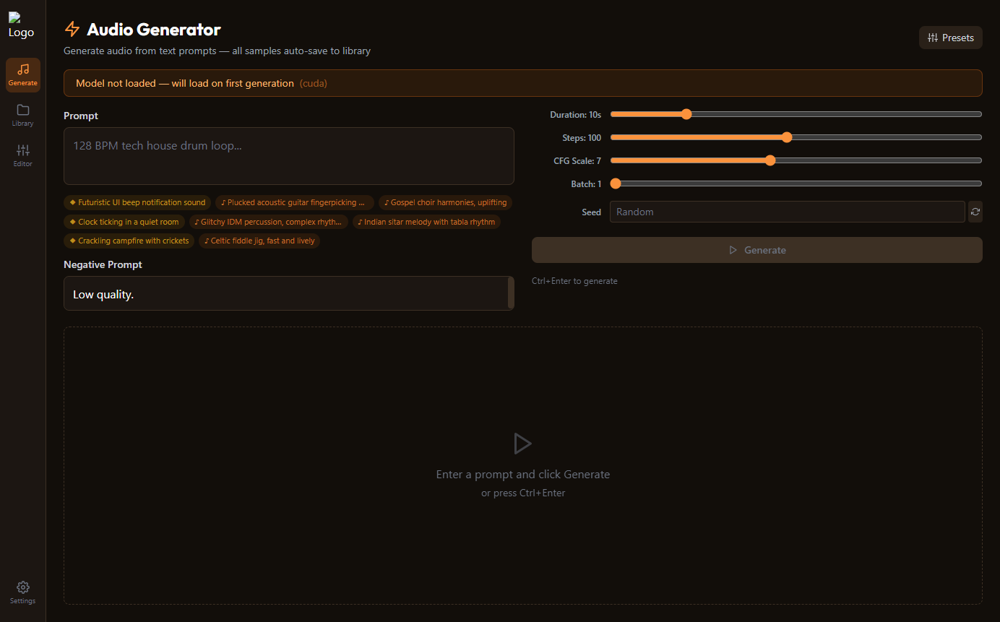
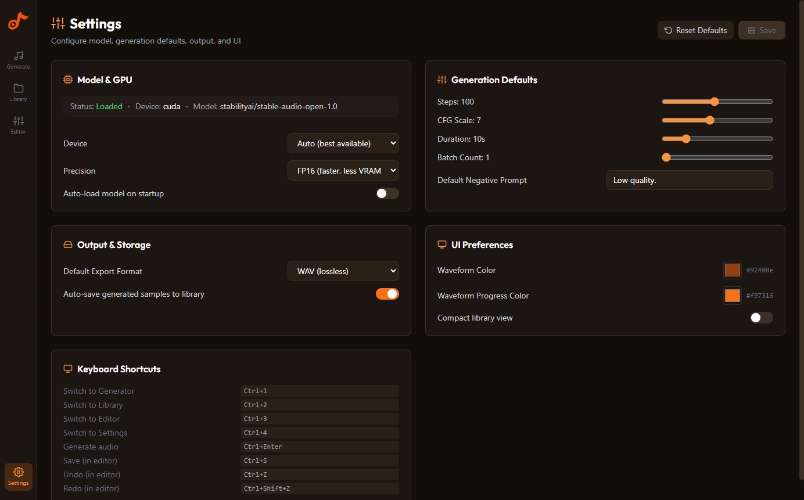
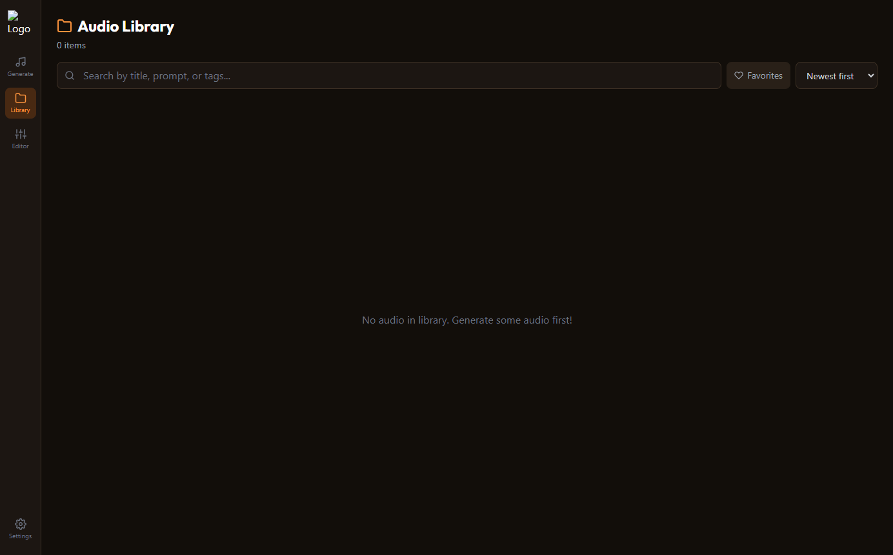
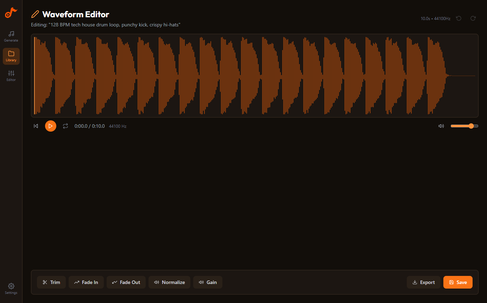

<p align="center">
  
</p>

<h1 align="center">Stable Audio Studio</h1>

<p align="center">
  <strong>AI-powered audio generation, right on your desktop.</strong><br/>
  Generate production-ready sound effects, music loops, ambient textures, and more, all running locally on your GPU.<br/>
  No cloud. No subscriptions. No data leaves your machine.
</p>

<p align="center">
  
  
  
  
  
</p>

---

## What is Stable Audio Studio?

Stable Audio Studio is a desktop application that puts the power of [Stable Audio Open 1.0](https://huggingface.co/stabilityai/stable-audio-open-1.0), a state-of-the-art text-to-audio diffusion model, into a polished, production-oriented workflow. Type a description, click Generate, and get studio-quality audio in seconds.

### Who is it for?

| Audience | Use Case |
|----------|----------|
| 🎮 **Game Developers** | Generate unique sound effects, ambient loops, UI sounds, and foley without licensing headaches |
| 🎬 **Content Creators** | Create custom background music, transitions, intros, and atmospheric audio for videos and podcasts |
| 🎵 **Music Producers** | Quickly prototype drum patterns, synth textures, bass lines, and vocal pads to spark ideas |
| 🎧 **Sound Designers** | Build libraries of original sounds (from sci-fi to nature) tailored to your project |
| 📱 **App Developers** | Generate notification sounds, button clicks, and ambient audio for mobile and web apps |
| 🎓 **Researchers & Students** | Experiment with generative audio models in an accessible GUI without writing code |

---

## Screenshots

<table>
<tr>
<td width="50%">

<p align="center"><strong>⚡ Audio Generator</strong>: Text-to-audio with prompt suggestions, batch generation, and real-time progress</p>
</td>
<td width="50%">

<p align="center"><strong>⚙️ Settings</strong>: GPU device, precision, generation defaults, export format, waveform colors</p>
</td>
</tr>
<tr>
<td width="50%">

<p align="center"><strong>📁 Audio Library</strong>: Search, tag, favorite, sort, and manage your generated collection</p>
</td>
<td width="50%">

<p align="center"><strong>✏️ Waveform Editor</strong>: Trim, fade, normalize, gain adjust with full undo/redo</p>
</td>
</tr>
</table>

---

## 🎧 Audio Samples

All samples below were generated with the app using Stable Audio Open 1.0 (50 steps, seed 42). Click to download:

| Sample | Prompt | Duration |
|--------|--------|----------|
| [🥁 drum-loop.wav](assets/samples/drum-loop.wav) | "128 BPM tech house drum loop, punchy kick, crispy hi-hats" | 10s |
| [🎹 piano-ambient.wav](assets/samples/piano-ambient.wav) | "Ambient piano melody in C minor with reverb and delay" | 10s |
| [⛈️ thunder-rain.wav](assets/samples/thunder-rain.wav) | "Thunder and heavy rain storm ambience" | 8s |
| [🕹️ retro-game-sfx.wav](assets/samples/retro-game-sfx.wav) | "Retro 8-bit video game coin pickup sound effect" | 3s |
| [🎛️ synth-pad.wav](assets/samples/synth-pad.wav) | "Warm analog synth pad with slow filter sweep" | 10s |
| [🎬 cinematic-hit.wav](assets/samples/cinematic-hit.wav) | "Cinematic orchestral hit with timpani and brass" | 5s |

> **To listen:** Clone the repo and open any `.wav` file in your audio player, or better yet, [install the app](#installation) and generate your own!

---

## Features

### 🎛️ Generation
- **Text-to-Audio:** Describe any sound and generate up to 47 seconds of stereo audio at 44.1kHz
- **Batch Generation:** Generate 1–8 samples per run with auto-incrementing seeds for instant variations
- **Generation Queue:** Queue additional batches while the current one is still running
- **Prompt Suggestions:** 50 curated prompts across Music (♪) and Sound Effects (◆), randomly shuffled as clickable chips
- **Parameter Presets:** Quick Draft, Balanced, High Quality, Long Form, and Max Length. One click to configure
- **Auto-save:** Every generated sample is automatically saved to your library
- **Real-time Progress:** Step-by-step progress bar; model loading status shown before first generation

### 📁 Library
- **Search & Filter:** Find samples by title, prompt text, or tags
- **Tag Management:** Add, remove, and filter by custom tags
- **Favorites:** Star your best samples for quick access
- **Sort:** By date, duration, or title (ascending/descending)
- **Bulk Operations:** Select multiple items for batch delete
- **Inline Playback:** Expand any item to preview with a waveform player and loop toggle

### ✏️ Audio Editor
- **Waveform Visualization:** WaveSurfer.js with region selection (drag to select)
- **Trim:** Cut to the selected region
- **Fade In / Fade Out:** Adjustable duration with parameter popovers
- **Normalize:** Peak normalization to 0 dB
- **Gain:** Adjust volume in dB with clipping protection
- **Undo / Redo:** Full 20-level undo stack (Ctrl+Z / Ctrl+Shift+Z)
- **Drag & Drop:** Import external audio files directly into the editor
- **Non-destructive:** Saves as a new copy; originals are preserved

### 📤 Export
- **Multi-format:** WAV, FLAC, MP3, OGG with a format-selection dialog
- **From anywhere:** Export from the generator, library, or editor

### ⚙️ Settings
- **Device:** Auto, CUDA (NVIDIA GPU), or CPU
- **Precision:** FP16 (faster, less VRAM) or FP32 (higher precision)
- **Generation Defaults:** Steps, CFG scale, duration, batch count, negative prompt
- **Export Format:** Default output format
- **Waveform Colors:** Custom waveform and progress bar colors
- **Persisted:** All settings saved to disk via electron-store

### 🎹 Keyboard Shortcuts
| Shortcut | Action |
|----------|--------|
| `Ctrl+1` | Switch to Generator |
| `Ctrl+2` | Switch to Library |
| `Ctrl+3` | Switch to Editor |
| `Ctrl+4` | Switch to Settings |
| `Ctrl+Enter` | Generate audio |
| `Ctrl+S` | Save (in editor) |
| `Ctrl+Z` | Undo (in editor) |
| `Ctrl+Shift+Z` | Redo (in editor) |

---

## Tech Stack

| Layer | Technology |
|-------|-----------|
| Desktop Shell | Electron 33 |
| Frontend | React 18 + TypeScript + Tailwind CSS |
| Build | Vite 5 + electron-vite |
| Audio Visualization | WaveSurfer.js 7 |
| Backend | Python 3.10+ + FastAPI + Uvicorn |
| ML Model | Stable Audio Open 1.0 via HuggingFace `diffusers` |
| ML Runtime | PyTorch 2.5+ with CUDA 12.1 |
| Audio Processing | torchaudio, soundfile, librosa, pydub |
| Database | SQLite (sql.js, WASM, no native compilation) |
| Packaging | electron-builder |
| E2E Testing | Playwright (Electron) + pytest (Python backend) |

---

## Getting Started

### Prerequisites

- **Node.js** ≥ 18: [download](https://nodejs.org/)
- **Python** 3.10–3.12: [download](https://www.python.org/downloads/)
- **NVIDIA GPU** with 8 GB+ VRAM and CUDA 12.1+ drivers (CPU works but is very slow)
- **Git**
- **HuggingFace account**: [Accept the Stable Audio Open 1.0 license](https://huggingface.co/stabilityai/stable-audio-open-1.0) (click "Agree")

### Installation

```bash
# 1. Clone
git clone https://github.com/powermcz/stable-audio-studio.git
cd stable-audio-studio

# 2. Node dependencies
npm install

# 3. Python environment (Windows)
cd python
python -m venv venv
venv\Scripts\pip install torch torchaudio --index-url https://download.pytorch.org/whl/cu121
venv\Scripts\pip install -r requirements.txt
cd ..

# 4. HuggingFace login
cd python && venv\Scripts\hf auth login && cd ..

# 5. Launch
npm run dev:electron
```

<details>
<summary><strong>macOS / Linux setup</strong></summary>

```bash
cd python
python3 -m venv venv
venv/bin/pip install torch torchaudio
venv/bin/pip install -r requirements.txt
venv/bin/hf auth login
cd ..
npm run dev:electron
```
</details>

On first launch, the model weights (~5 GB) will be downloaded and cached at `~/.cache/huggingface/hub/`. Subsequent launches use the cache and load the model in ~12 seconds on CUDA.

---

## How It Works

```
┌─────────────────────────────────────────────────────────┐
│                   Electron App                           │
│                                                          │
│  Renderer (React)  ←IPC→  Main Process  ←HTTP→  Python  │
│  ┌─────────────┐          ┌──────────┐        ┌───────┐ │
│  │ Generator    │          │ IPC      │        │FastAPI│ │
│  │ Library      │──────────│ Handlers │────────│       │ │
│  │ Editor       │          │ SQLite   │        │Stable │ │
│  │ Settings     │          │ Settings │        │Audio  │ │
│  └─────────────┘          └──────────┘        └───────┘ │
└─────────────────────────────────────────────────────────┘
```

1. You type a text prompt in the **Generator** view
2. The **React renderer** sends an IPC call through the **preload bridge** (`window.api`)
3. The **Electron main process** forwards it as an HTTP request to the **Python FastAPI backend** on port 8765
4. The **Python backend** runs the **Stable Audio Open 1.0** diffusion pipeline on your GPU
5. Generated audio returns as PCM 16-bit WAV through the same chain
6. **WaveSurfer.js** renders the waveform; you can play, loop, export, edit, or save to your library

---

## Available Scripts

| Script | Description |
|--------|-------------|
| `npm run dev:electron` | Start the app in dev mode with hot reload |
| `npm run build` | Build main, preload, and renderer |
| `npm run typecheck` | TypeScript strict-mode check |
| `npm run test:backend` | Run Python E2E tests (pytest, 11 tests, real model) |
| `npm run test:smoke` | Quick backend smoke test |
| `npm run python:dev` | Start Python backend standalone |
| `npm run package:win` | Package as Windows installer (NSIS) |
| `npm run package:mac` | Package as macOS DMG |
| `npm run package:linux` | Package as Linux AppImage |

---

## Troubleshooting

| Problem | Solution |
|---------|----------|
| `Cannot read properties of undefined (reading 'generateAudio')` | Use `npm run dev:electron`, not `npm run dev` |
| Model timeout on first launch | The ~5 GB model is downloading. Check `~/.cache/huggingface/hub/` |
| `403 Forbidden` downloading model | [Accept the license](https://huggingface.co/stabilityai/stable-audio-open-1.0) on HuggingFace |
| `ImportError: torchsde` | `pip install torchsde` in your venv |
| `CUDA out of memory` | Close GPU apps. Model needs ~4 GB VRAM |
| Python backend not starting | Check `python/venv/` exists. Run `npm run python:dev` to test |
| `ERR_REQUIRE_ESM` | electron-store v10 needs dynamic import, already fixed in codebase |

---

## License

This project uses [Stable Audio Open 1.0](https://huggingface.co/stabilityai/stable-audio-open-1.0) under the [Stability AI Community License](https://huggingface.co/stabilityai/stable-audio-open-1.0/blob/main/LICENSE.md). For commercial use, see [stability.ai/license](https://stability.ai/license).

The training data consists of audio licensed under CC0, CC-BY, and CC Sampling+. See [attributions](https://info.stability.ai/attributions).
